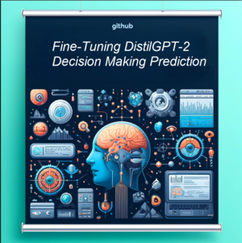

# NLP_project_206567067_318155843
NLP - 097215 - Final Project
Refining decision prediction in persuasion games using a pre-trained transformer, namely Distilgpt2.


# Fine-Tuning DistilGPT-2 for Decision Making Prediction

<p align="center">
  
</p>


## Table of Contents

- [Introduction](#introduction)
- [Features](#features)
- [Installation](#installation)
- [Acknowledgements](#acknowledgements)

## Introduction

This project aims to fine-tune DistilGPT-2 for the task of predicting decision makers' choices based on various types of input data. The model is evaluated on several datasets to understand the impact of different contextual information on its performance.

## Features

- Fine-tuning DistilGPT-2 for classification tasks.
- Evaluation of model performance on multiple datasets.
- Analysis of the impact of contextual data on prediction accuracy.
- Visualization of model accuracy across different experiments.

## Installation

To get started, clone the repository and install the necessary dependencies:

```bash
git clone https://github.com/yourusername/NLP_project_206567067_318155843.git
cd NLP_project_206567067_318155843
pip install -r requirements.txt
```

## Acknowledgements
We would like to thank Eilam for their support and Technion for providing the resources for this project.


